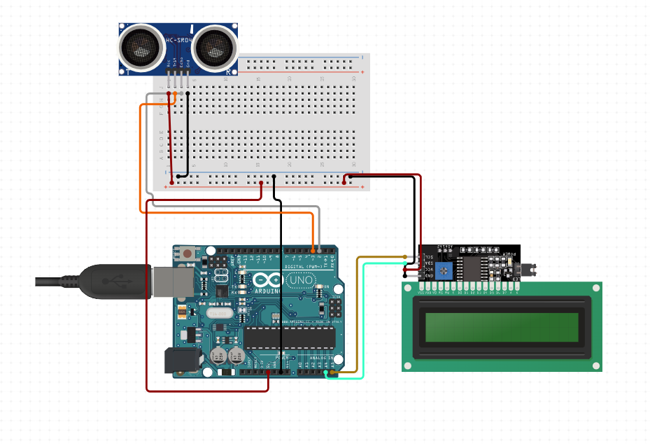

# Distance Estimation Arduino Project

## Overview
This Arduino project utilizes Ultrasonic Distance Sensor HC-SR04 to estimate distances. The project is designed to Measure and display the distance.

## Table of Contents
- [Requirements](#requirements)
- [Hardware Setup](#hardware-setup)
- [Arduino Code](#arduino-code)

## Requirements
To use this project, you'll need the following:

- **Arduino Board:** Arduino Uno
- **Ultrasonic Distance Sensor:** HC-SR04
- **LCD with 12C module**
- **Breadboard**

## Hardware Setup
1. Connect the Ultrasonic Distance Sensor and the LCD to the Arduino board following the datasheet as the following:


## Arduino Code
Clone this repository to your local machine and upload the provided Arduino sketch (`DistanceEstimation.ino`) to your Arduino board using the Arduino IDE.

```bash
git clone https://github.com/EasyPeasyarduino/DistanceEstimationArduino.git


